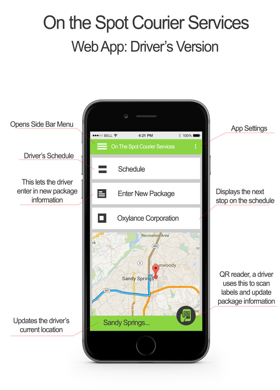

## Summary

This report is to show what hardware & software will improve the courier service. First I will start by showing a list of the Standard Equipment: Office Systems, Mobile Systems, Networking Equipment, and Specialized Software.  Then I will show you three Server Options that I think will meets the needs of the business. 

The server options have been divided into three groups. The first option is a custom built system. This option will have the greatest amount of flexibility. Second on the list is an Off the Shelf server. This will save you some on labor cost and time, over the first option. The third option is to use a server service. The best thing about this option is that they take care of most of the maintenance for you.

I recommend that you start out with the web based server service. As it has low maintenance and it costs the least to get up and running. As the business grows I also recommend that you look into getting your own servers.

## Introduction

After looking in to the needs of On the Spot Courier Service to improve its service system, we have found what we think is a good solution. What we have in mind is a web based system that will work on a computer as well as a smartphone. This system will rely on a server to share the needed information over the internet to all devices.  

All of the infrastructure needed for this new system have been listed in the Findings section of the report. There you will find the standard equipment needed to run the new system, as well as three different server option to choose from. 

## Findings

The following are the Standard Equipment that comes with all three server option. The standard equipment was chosen to meet the needs of the business, and because they work well with the Windows ecosystem.

There are four Standard Equipment categories: Office Systems, Mobile Systems, Networking Equipment, and Specialized Software. As you can see we have listed the quantity of each part, the part itself, the price, and the total part price, as well as the total price in each category. 

Office Systems

<table>
<tbody>
<tr>
<td width="36">

3

</td>
<td width="264">

Desktop PC

</td>
<td width="84">

$299.99

</td>
<td width="108">

$899.97

</td>
</tr>
<tr>
<td width="36">

3

</td>
<td width="264">

21.5&rdquo; Monitor

</td>
<td width="84">

$139.99

</td>
<td width="108">

$419.97

</td>
</tr>
<tr>
<td width="36">

2

</td>
<td width="264">

Xerox Laser Printer

</td>
<td width="84">

$800.99

</td>
<td width="108">

$1,601.98

</td>
</tr>
<tr>
<td width="36">

<strong>&nbsp;</strong>

</td>
<td width="264">

<strong>&nbsp;</strong>

</td>
<td width="84">

<strong>&nbsp;</strong>

</td>
<td width="108">

<strong>$2,921.92</strong>

</td>
</tr>
</tbody>
</table>

&nbsp;

Mobile Systems

<table>
<tbody>
<tr>
<td width="36">

5

</td>
<td width="264">

Mobile Label Printer

</td>
<td width="84">

$850.90

</td>
<td width="108">

$4,254.50

</td>
</tr>
<tr>
<td width="36">

5

</td>
<td width="264">

Windows Cell Phone

</td>
<td width="84">

$144.99

</td>
<td width="108">

$724.95

</td>
</tr>
<tr>
<td width="36">

1

</td>
<td width="264">

Quad Charger (Printer)

</td>
<td width="84">

$478.99

</td>
<td width="108">

$478.99

</td>
</tr>
<tr>
<td width="36">

<strong>&nbsp;</strong>

</td>
<td width="264">

<strong>&nbsp;</strong>

</td>
<td width="84">

<strong>&nbsp;</strong>

</td>
<td width="108">

<strong>$5,458.44</strong>

</td>
</tr>
</tbody>
</table>

&nbsp;

Networking Equipment

<table>
<tbody>
<tr>
<td width="36">

2

</td>
<td width="264">

Firewall

</td>
<td width="84">

$232.99

</td>
<td width="108">

$465.98

</td>
</tr>
<tr>
<td width="36">

2

</td>
<td width="264">

Desktop Switch

</td>
<td width="84">

$29.99

</td>
<td width="108">

$59.98

</td>
</tr>
<tr>
<td width="36">

2

</td>
<td width="264">

Router

</td>
<td width="84">

$123.99

</td>
<td width="108">

$247.98

</td>
</tr>
<tr>
<td width="36">

<strong>&nbsp;</strong>

</td>
<td width="264">

<strong>&nbsp;</strong>

</td>
<td width="84">

<strong>&nbsp;</strong>

</td>
<td width="108">

<strong>$773.94</strong>

</td>
</tr>
</tbody>
</table>

&nbsp;

Specialized Software

<table>
<tbody>
<tr>
<td width="36">

1

</td>
<td width="264">

SQL Database

</td>
<td width="84">

$0.00

</td>
<td width="108">

$0.00

</td>
</tr>
<tr>
<td width="36">

1

</td>
<td width="264">

Printer Smartphone Utility

</td>
<td width="84">

$0.00

</td>
<td width="108">

$0.00

</td>
</tr>
<tr>
<td width="36">

1

</td>
<td width="264">

Apache License

</td>
<td width="84">

$0.00

</td>
<td width="108">

$0.00

</td>
</tr>
<tr>
<td width="36">

<strong>&nbsp;</strong>

</td>
<td width="264">

<strong>&nbsp;</strong>

</td>
<td width="84">

<strong>&nbsp;</strong>

</td>
<td width="108">

<strong>$0.00</strong>

</td>
</tr>
</tbody>
</table>

&nbsp;

Standard Equipment Total

<table>
<tbody>
<tr>
<td width="312">

<strong>Standard Equipment</strong>

</td>
<td width="180">

<strong>$9,154.30</strong>

</td>
</tr>
</tbody>
</table>

## Server Option I

The first server option is to build your own custom server. This allows you to have complete control over your server from the start. This option will have the greatest amount of flexibility.

One of the biggest down side to the custom server is that it will cost the most upfront. As with any in house server you will need to have access to a technician for emergency situations and maintenance.

<table>
<tbody>
<tr>
<td width="36">

1

</td>
<td width="172">

Server case

</td>
<td width="104">

$96.99

</td>
<td width="104">

$96.99

</td>
</tr>
<tr>
<td width="36">

1

</td>
<td width="172">

Motherboard

</td>
<td width="104">

$149.99

</td>
<td width="104">

$149.99

</td>
</tr>
<tr>
<td width="36">

1

</td>
<td width="172">

Processor

</td>
<td width="104">

$249.99

</td>
<td width="104">

$249.99

</td>
</tr>
<tr>
<td width="36">

2

</td>
<td width="172">

8GB RAM

</td>
<td width="104">

$89.99

</td>
<td width="104">

$179.98

</td>
</tr>
<tr>
<td width="36">

1

</td>
<td width="172">

64GB Hard Drive

</td>
<td width="104">

$150.50

</td>
<td width="104">

$15.50

</td>
</tr>
<tr>
<td width="36">

4

</td>
<td width="172">

1TB Hard Drive

</td>
<td width="104">

$159.94

</td>
<td width="104">

$639.76

</td>
</tr>
<tr>
<td width="36">

1

</td>
<td width="172">

Drive Bay Adapter

</td>
<td width="104">

$8.99

</td>
<td width="104">

$8.99

</td>
</tr>
<tr>
<td width="36">

1

</td>
<td width="172">

Blu-Ray Drive

</td>
<td width="104">

$44.99

</td>
<td width="104">

$44.99

</td>
</tr>
<tr>
<td width="36">

1

</td>
<td width="172">

Keyboard &amp; Mouse

</td>
<td width="104">

$14.99

</td>
<td width="104">

$14.99

</td>
</tr>
<tr>
<td width="36">

1

</td>
<td width="172">

20&rdquo; Monitor

</td>
<td width="104">

$109.99

</td>
<td width="104">

$109.99

</td>
</tr>
<tr>
<td width="36">

1

</td>
<td width="172">

Windows Server 2012

</td>
<td width="104">

$399.99

</td>
<td width="104">

$399.99

</td>
</tr>
<tr>
<td width="36">

16

</td>
<td width="172">

Build Labor Cost

</td>
<td width="104">

$60.00

</td>
<td width="104">

$960.00

</td>
</tr>
<tr>
<td width="36">

<strong>&nbsp;</strong>

</td>
<td width="172">

<strong>&nbsp;</strong>

</td>
<td width="104">

<strong>&nbsp;</strong>

</td>
<td width="104">

<strong>$3,006.16</strong>

</td>
</tr>
</tbody>
</table>

&nbsp;

Grand Total for Option I

<table>
<tbody>
<tr>
<td width="203">

Server Option I

</td>
<td width="203">

$3,006.16

</td>
</tr>
<tr>
<td width="203">

Standard Equipment

</td>
<td width="203">

$9,154.30

</td>
</tr>
<tr>
<td width="203">

<strong>&nbsp;</strong>

</td>
<td width="203">

<strong>$12,160.46</strong>

</td>
</tr>
</tbody>
</table>
## Server Option II

You don’t have to build a server you can just buy one. The Dell server here is a little over $500 less than the custom server. This will save you some on labor cost and time.

The Dell server can be customized but your options are somewhat less than a true custom server. The companies that make “Off the Shelf” computers and servers tend to use lower quality parts to keep the costs down. Like with option one you will need to have access to a technician for emergency situations and maintenance.

<table>
<tbody>
<tr>
<td width="36">

1

</td>
<td width="264">

Dell Server

</td>
<td width="84">

$1,627.86

</td>
<td width="108">

$1,627.86

</td>
</tr>
<tr>
<td width="36">

2

</td>
<td width="264">

Spare 1TB Hard Drive

</td>
<td width="84">

$159.94

</td>
<td width="108">

$319.88

</td>
</tr>
<tr>
<td width="36">

8

</td>
<td width="264">

System Labor

</td>
<td width="84">

$60.00

</td>
<td width="108">

$480.00

</td>
</tr>
<tr>
<td width="36">

<strong>&nbsp;</strong>

</td>
<td width="264">

<strong>&nbsp;</strong>

</td>
<td width="84">

<strong>&nbsp;</strong>

</td>
<td width="108">

<strong>$2,427.74</strong>

</td>
</tr>
</tbody>
</table>

&nbsp;

Grand Total for Option II

<table>
<tbody>
<tr>
<td width="203">

Server Option II

</td>
<td width="203">

$2,427.74

</td>
</tr>
<tr>
<td width="203">

Standard Equipment

</td>
<td width="203">

$9,154.30

</td>
</tr>
<tr>
<td width="203">

<strong>&nbsp;</strong>

</td>
<td width="203">

<strong>$11,582.04</strong>

</td>
</tr>
</tbody>
</table>

## Server Option III

Option three is a server service. You don’t have to have a physical server at all. You can use one of the many cloud based server services. With a server service you pay a company like Rackspace a monthly fee to use their servers. The best thing about this option is that they take care of most of the maintenance for you. You will also be able to quickly scale the service up or down according to your needs.

One down sides to a server service is security. You have no real control over the servers, so you have to trust that the company is doing everything right. You will have to pay monthly or yearly for the service.

<table>
<tbody>
<tr>
<td width="36">

8

</td>
<td width="264">

Installation

</td>
<td width="84">

$60.00

</td>
<td width="108">

$480.00

</td>
</tr>
<tr>
<td width="36">

&nbsp;

</td>
<td width="264">

&nbsp;

</td>
<td width="84">

&nbsp;

</td>
<td width="108">

&nbsp;

</td>
</tr>
<tr>
<td width="36">

12

</td>
<td width="264">

Web Server (per Month)

</td>
<td width="84">

$48.96

</td>
<td width="108">

$587.52

</td>
</tr>
<tr>
<td width="36">

<strong>&nbsp;</strong>

</td>
<td width="264">

<strong>&nbsp;</strong>

</td>
<td width="84">

<strong>&nbsp;</strong>

</td>
<td width="108">

<strong>$1,067.52</strong>

</td>
</tr>
</tbody>
</table>

&nbsp;

Grand Total for Option III

<table>
<tbody>
<tr>
<td width="203">

Server Option III

</td>
<td width="203">

$1,067.52

</td>
</tr>
<tr>
<td width="203">

Standard Equipment

</td>
<td width="203">

$9,154.30

</td>
</tr>
<tr>
<td width="203">

<strong>&nbsp;</strong>

</td>
<td width="203">

<strong>$10,221.82</strong>

</td>
</tr>
</tbody>
</table>

## Recommendations

I think it is best to start off with Option III as it is low maintenance and cost the least to get up and running. If you find that you need more you can update your package and not have to build a new server. As time goes on and the company grow, I do think you should look into Options I & II and maybe even build a server room. 
