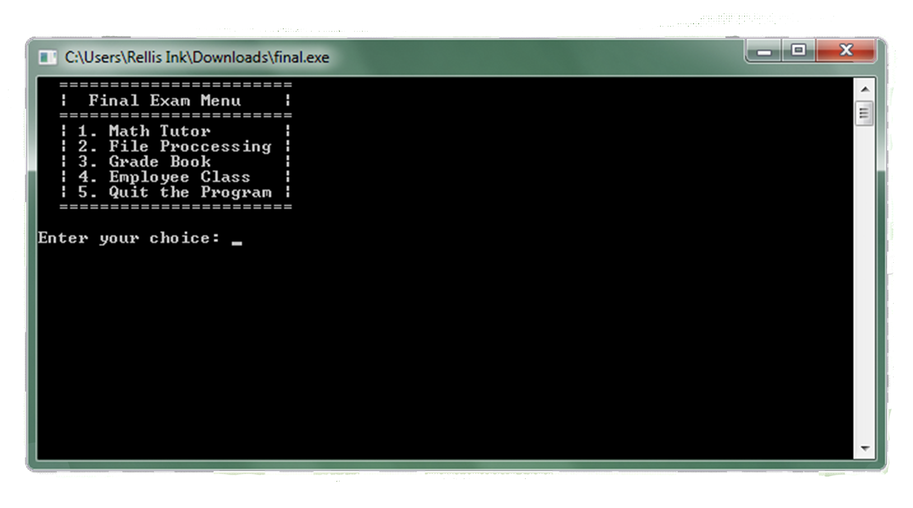

 The Final Exam Menu was the final exam for my C++ class. It is a compilation of what we learned that semester.

"Excellent work on this part of the final exam. So far you are the only one to get all parts correct." -Professor Terry Ayers

Here is an excerpt from my code,:

<pre>
void FileProccessing()
{
    ifstream infile;
    int number, totNum=0, numCount=0;
    double avg = 0.0;
    char Again = 'Y';
do
{
    system("CLS");
    infile.open("random.txt");
cout<< endl << endl;
cout<< "Using Files--Numeric Processing" << endl;
cout<< "----------------------------------------" << endl;
    if (infile)
    {
        while (infile >> number)
        {
            cout<<number<<endl;
            totNum += number;
            numCount += 1;
        }
        infile.close();
    }
    else
        cout<<"TXT file opening error.";

    if (numCount >0)
    {
        avg = (1.0*totNum)/numCount;
        cout<< "----------------------------------------" << endl;
        cout<< "The number of numbers: " << numCount << endl;
        cout<< "The sum of all the numbers: " << totNum<< endl;
        cout<< "The avrage of all the numbers: " << avg << endl;
        cout<< "----------------------------------------" << endl;
    }
    cout<<"\nwould you like to run the project again? (Y/N): ";
    cin>>Again;
    Again=toupper(Again);
}while (Again != 'N');

} 
</pre>
 

 
Source Files: <a href="https://github.com/michaelerichardson/C-Final-Exam-Menu"><i class="large github icon"></i>Michael Richardson/C++ Final Exam Menu</a>
